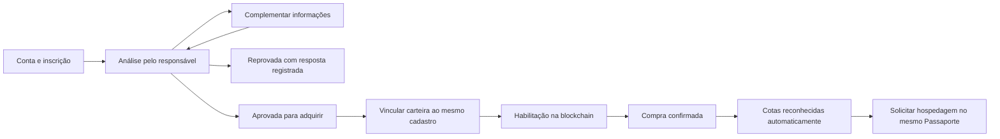

# Jornada unificada, waitlist, custódia e cancelamento

## Aceites posteriores e estado de execução — 25/09/2026

O usuário aprovou a integração, login por e-mail/senha antes/depois da compra (Q14), cinco dias úteis (Q15), checklist provisório (Q16) e três modalidades: custódia IBITI, autocustódia assistida e direta. Escolha alterável antes da autorização/envio da compra; transação já enviada exige conciliação. A conta identifica automaticamente a pessoa ao solicitar hospedagem, sem conexão de carteira.

Q17: pesquisar tarifário real; posteriormente o usuário decidiu **cancelamento manual provisório**. Essa decisão substitui a aprovação momentânea de crédito de meia cota e todas as hipóteses de 14 dias deste documento. Não implementar fracionamento. Tarifário monetário é referência para análise, não regra automática de cotas.

Código novo: `offchain/src/portal.ts`, `portal-api.ts`, `purchase.ts`, `runtime.ts`, telas `portal.*` e bootstrap individual. Teste integra cadastro/compra/cotas com EVM local. Fonte/escopo/limites e execução em `offchain/PORTAL.md`. As seções abaixo preservam a proposta avaliada; os aceites deste bloco prevalecem. Mudanças de calendário, rateio e governança do contrato continuam registradas separadamente e não são declaradas implementadas por esta jornada.

25/09/2026. Planejamento solicitado pelo usuário com `grill-with-docs`, com inspeção do código existente. **Desenho em revisão, não implementação concluída.** Este registro complementa a [consolidação de 23/09](2026-09-23-consolidacao-das-anotacoes.md). Não substitui recomendações pendentes por aprovações implícitas.

## Objetivo e decisões já recebidas

O usuário quer uma única jornada: inscrição → análise administrativa → aprovação/reprovação → compra → cotas e hospedagem no mesmo cadastro. O nome e o histórico ficam no sistema externo; a carteira e os IBT ficam vinculados à mesma pessoa, sem recadastro ou concessão manual de cotas após a compra. A waitlist deve se tornar funcional nesta etapa, com acesso individual administrativo e ficha do candidato.

Q1 foi novamente confirmada: rateio por quantidade e tempo de posse durante o semestre. Os demais aceites anteriores foram reafirmados; cancelamento continua sujeito à comparação e escolha. O memorando v2 será enviado **ao final das modificações**; não solicitá-lo agora nem usá-lo como impedimento ao trabalho autorizado.

Aprovar a candidatura habilita o próximo passo da aquisição. Não entrega tokens, não comprova pagamento e não concede cotas. Essa distinção é necessária para cumprir a jornada solicitada sem introduzir direitos fictícios.

## Evidência no código atual

| Parte | Situação observada | Fonte |
| --- | --- | --- |
| Inscrição pública | Nome, e-mail, quantidade e preferência aparecem no protótipo; submissão apenas altera a tela, sem persistência ou envio. | `guia-de-comunicacao/landing/adquirir.html`, `purchase.js` |
| Cadastro | UUID e CPF em HMAC único; falta nome, contato e candidatura. `verified=false` não distingue pendência, reprovação ou revogação. | `offchain/src/ledger.ts` |
| Administração | Chave compartilhada `ADMIN_API_TOKEN`, sem conta individual, fila, busca ou autor obrigatório de decisão. | `offchain/src/api.ts`, `server.ts`, `public/app.js` |
| Pessoa/carteira | Vínculo exclusivo, desafio assinado e sessão já existem; só funciona após cadastro/aprovação administrativa. | `offchain/src/auth.ts`, `ledger.ts` |
| Registro on-chain | API prepara os dados; assinatura ainda é feita pelo administrador em outra ferramenta. | `offchain/src/api.ts` |
| Compra | Contrato e script fazem autorização da moeda e compra; não há checkout conectado ao Passaporte. | `smart-contract/contracts/IBIToken.sol`, `scripts/02_operar.js` |
| Cotas | Eventos confirmados atualizam saldo e direitos da pessoa; pedidos, consumos e recuperação preservam histórico. | `offchain/src/chain.ts`, `ledger.ts` |
| Cancelamento | Pedidos solicitados/confirmados podem ser cancelados, com devolução integral única após sincronização; não há prazo ou no-show. | `offchain/src/ledger.ts` |

Portanto, a ligação carteira → pessoa → cotas existe parcialmente. A entrada pública, o acesso anterior à carteira e a aprovação individual não estão conectados a ela.

## Arquitetura recomendada

Ampliar o serviço Node/TypeScript e SQLite existente, preservando o identificador da pessoa e o indexador. Servir aquisição, conta, Passaporte e administração sob a mesma origem, com HTML/CSS/JS já usados no projeto. Preservar a direção visual Luz do bosque e não introduzir um framework ou provedor de custódia apenas para unificar as telas.

Alternativas consideradas: construir um sistema independente de waitlist obrigaria conciliação e mais de um cadastro; migrar agora para outra plataforma de identidade/banco aumentaria o escopo e a dependência externa. Expandir o serviço existente é a recomendação porque a ligação com carteira/cotas já está implementada.

Todos os passos referenciam a mesma pessoa. A interface apresenta o andamento; não obriga o candidato a copiar UUID, reenviar o nome ou abrir um cadastro de hospedagem. A assinatura inicial da carteira e as autorizações de compra continuam necessárias na autocustódia. Para solicitar uma cota depois, a sessão da conta identifica a pessoa; não se exige novo cadastro ou nova prova de posse a cada hospedagem.

A habilitação on-chain pode ficar pendente mesmo com candidatura aprovada. O login do funcionário não lhe dá a chave de uma carteira administrativa. O painel deve reunir a ação autorizada de assinatura e seu acompanhamento, sem guardar chaves privadas no backend ou conceder cotas no clique de aprovação.

## Identidade e fonte de cada informação

- **Conta de acesso:** autentica candidato/participante. Recomendação em consulta: e-mail e senha, sem carteira obrigatória na inscrição; sessão persistente com encerramento e recuperação seguros.
- **Pessoa:** mantém o UUID existente, nome completo e contato privados, identificador de identidade, resultado da verificação e vínculo com a conta. CPF em HMAC continua sendo deduplicação, não prova de identidade. Não conectar uma conta nova à pessoa existente apenas porque informou o mesmo CPF ou e-mail.
- **Candidatura:** guarda respostas, preferência de atendimento, quantidade de interesse (não reserva estoque), estado, prazos e versão. Pendência não significa reprovação.
- **Decisão:** registra quem decidiu, quando, motivo interno e comunicação ao candidato. Histórico é preservado, sem reescrever a decisão antiga.
- **Carteira:** vinculada uma vez mediante prova de controle e habilitada no contrato para a mesma pessoa. Recuperação preserva vínculo, cotas e recebíveis.
- **Compra:** registra intenção, transação e estado de confirmação; quantidade de interesse não é compra e hash informado pelo navegador não é prova suficiente.
- **Cotas:** resultam dos eventos verificados e das operações de hospedagem. Não são concedidas ao aprovar a candidatura ou ao clicar em pagar.

Nome, e-mail e evidências pessoais ficam privados no sistema externo. A blockchain continua recebendo identificador opaco e endereços, não o nome da pessoa.

## Waitlist proposta

### Campos e estados

Recomendação inicial: nome completo, e-mail, contato, quantidade de interesse, preferência assistida/direta e respostas ao checklist de seleção. O reconhecimento da identidade deve usar o procedimento híbrido já aceito. Nesta entrega, a interface registra evidências e resultados simulados/documentados; não declara integração real com um fornecedor inexistente.

Se for necessário um checklist provisório acadêmico, a proposta mínima é registrar: identidade e unicidade conferidas; contato confirmado; informações requeridas completas; ciência dos direitos, limites e ausência de revenda; quantidade pretendida compatível com o teto; decisão fundamentada do responsável. A prova de controle da carteira ocorre antes da compra e não precisa bloquear a inscrição inicial. Critérios adicionais de adequação ao programa devem vir da IBITI; não inventar patrimônio mínimo, reputação presumida ou perfil social como filtro.

Estados de negócio: `recebida`, `em análise`, `aguardando complemento`, `aprovada`, `reprovada`, `retirada pelo candidato`. A abertura do Glamping controla a possibilidade de comprar; a waitlist pode funcionar antes da abertura sem configurar pré-venda.

O candidato acompanha a própria inscrição. A mesma inscrição recebe complementos; nova submissão/recarregamento não duplica pessoa nem candidatura ativa. Uma decisão não pode sobrescrever silenciosamente a de outro administrador: usar versão esperada e rejeitar conflito.

### Prazo recomendado, ainda em consulta

**Até cinco dias úteis após o cadastro completo**, usando fuso `America/Sao_Paulo` e calendário de atendimento explicitado. Comparação: três dias exigem maior disponibilidade da equipe; sete oferecem mais margem, mas aumentam a espera. Cinco é proposta operacional para este projeto, não prazo legal nem garantia de capacidade da IBITI.

Enviar recibo imediato no portal com protocolo e data prevista. Se faltar informação, a equipe deve pedir complemento de forma específica e mostrar o efeito na data prevista. Registrar tempo total decorrido e tempo de análise separadamente; não reiniciar indefinidamente o prazo ou ocultar o atraso com trocas de estado. Ao vencer, destacar atraso e escalar para supervisão, sem aprovar ou reprovar automaticamente.

Se forem adotados dias úteis, o calendário de feriados aplicável deve ser configurado e a data exata exibida ao candidato; não presumir que basta pular sábado/domingo para toda a operação. A espera por complemento deve ser visível ao candidato, com histórico. Esses detalhes integram a proposta, não uma regra já confirmada.

### Resposta ao candidato

O resultado fica disponível na própria conta: aprovado, reprovado ou pedido de complemento, com próximo passo e texto adequado ao candidato. Recomendação adicional: aviso por e-mail contendo link para a conta, sem dossiê sensível. O canal de e-mail depende de integração externa; ausência/falha de envio não pode apagar a decisão ou impedir consulta no portal. Não simular um envio como entregue.

Reprovação terá motivo interno obrigatório; texto público evita revelar dados de terceiros ou detalhes de controles antifraude. Reanálise deve preservar a mesma pessoa e o histórico. O procedimento de contestação de seleção não se confunde com os sete dias de recuperação de carteira.

## Painel do administrador

Login individual e permissões por função; não usar o segredo compartilhado atual como identidade de um funcionário. Recomenda-se segundo fator para contas com poder de aprovação. Criação de administradores ocorre por procedimento restrito; formulário público não recebe escolha de papel.

O painel deve oferecer:

1. Fila com nome, data de entrada, estado, prazo e responsável; filtros por pendência/atraso/decisão e busca autenticada.
2. Ficha com dados fornecidos, checklist, resultado de verificação, contatos, preferência de atendimento e quantidade pretendida.
3. Histórico de quem consultou/alterou/decidiu, observações e comunicação pública separada das notas internas.
4. Aprovar, reprovar ou solicitar complemento, sempre com autor e justificativa; revisão independente para exceções e atos críticos conforme governança aceita.
5. Depois da compra: carteiras vinculadas, habilitação on-chain, transações verificadas, saldo, cotas livres/comprometidas/usadas, hospedagens, royalties e processos de recuperação.

“Qualquer informação relacionada ao cliente” é tratado como uma ficha completa **das informações pertinentes coletadas ou verificadas pelo projeto**, respeitando os poderes do funcionário. Não inclui senha, chave privada, frase secreta ou busca indiscriminada sobre a pessoa. Ficha completa não significa que qualquer papel pode editar/ver todo campo. [OWASP — autenticação](https://cheatsheetseries.owasp.org/cheatsheets/Authentication_Cheat_Sheet.html) e [autorização](https://cheatsheetseries.owasp.org/cheatsheets/Authorization_Cheat_Sheet.html).

## Integração resistente a falhas

Compra/registro on-chain e banco de dados não formam uma única transação. A unidade da jornada deve vir de identidade consistente, estados explícitos e reconciliação:

- Clique repetido, recarga ou retry não duplicam inscrição, decisão, compra reconhecida ou cotas.
- Aprovação comercial não substitui assinatura de carteira, registro on-chain ou pagamento.
- A habilitação da compra depende de cadastro aprovado e registro on-chain confirmado; o estado interno nunca deve mostrar habilitado com base apenas no envio de transação.
- Login, acompanhamento da waitlist e decisão cadastral devem funcionar durante indisponibilidade do RPC. Operações que exigem saldo/cotas frescos aguardam validação; informações antigas aparecem com sua data.
- Não retornar a cadastro inicial após compra revertida, rede errada ou fechamento da página. Retomar do último estado comprovado.
- Reconhecer compras pelo contrato, rede, carteira e eventos esperados, não por recibo arbitrário fornecido pelo usuário.
- Revogação de aprovação requer efeito coerente nas camadas: hoje o booleano externo não remove automaticamente habilitação on-chain. A política de suspender novas compras precisa de suporte contratual e não pode ser anunciada como resolvida só pelo frontend. Não confiscar saldos/recebíveis por consequência automática.
- Sem mercado secundário, transferências ordinárias entre pessoas devem ser efetivamente restringidas no contrato. A integração não reintroduz revenda.

## Plano técnico proposto

Este é o mapa de implementação ligado ao código; acesso, prazo e critérios estão em consulta. Os nomes de módulos novos são propostos e não indicam arquivos já criados.

| Etapa | Arquivos e mudança | Entrega verificável |
| --- | --- | --- |
| 1. Identidade e candidatura | Criar migrações versionadas em `offchain/src/migrations.ts`, módulo de candidaturas e perfil; ajustar SQL explícito em `ledger.ts`. | Preservar UUIDs, HMACs, saldos e cotas existentes; inscrição persistente e sem duplicações. |
| 2. Acesso individual | Evoluir `auth.ts` com módulos separados para acesso do candidato e do operador; integrar `api.ts`/`server.ts`. | Candidato consulta apenas sua inscrição; funcionário tem sessão e papel próprios; trilha registra ator. |
| 3. Formulário e painel | Tornar `purchase.js` persistente, adaptar `adquirir.html`, criar telas de conta/fila/ficha em `offchain/public/`; servir conjunto na mesma origem. | Inscrição → decisão → resposta visível após recarga; nome/contacto reais do cadastro, sem UUID digitado. |
| 4. Carteira e habilitação | Reutilizar desafio assinado e preparação de registro; disponibilizar fluxo nas telas, acompanhar transação e manter o mesmo UUID. | Conta aprovada vincula carteira e passa por habilitação sem segundo cadastro. |
| 5. Compra e Passaporte | Criar preparação/acompanhamento de compra, ações de carteira e conciliação em `api.ts`, `chain.ts` e frontend; preservar cotas em `ledger.ts`. | Compra confirmada aparece na conta e libera cotas automaticamente; nenhum botão administrativo de concessão duplicada. |
| 6. Hospedagem e política | Reutilizar pedidos/confirmar/concluir; acrescentar política versionada de cancelamento depois da escolha. | Solicitação usa a mesma sessão/pessoa; nenhuma cota duplicada, débito duplo ou penalidade retroativa. |
| 7. Compatibilidade com decisões do token | Ajustar contrato/testes/scripts às decisões anteriores: tempo de posse, abertura, sem pré-venda/secundário, governança, pausa e recuperação. | A jornada não promete comportamentos que o contrato não garante. |

A primeira entrega de software deve fechar etapas 1–3 (waitlist funcional); a continuidade até cotas fecha etapas 4–5, mantendo as guardas da etapa 7. Isso define prioridade, não abandona a integração solicitada. Não transformar a waitlist em uma landing demonstrativa adicional.

### Verificação prevista

- Migração de banco anterior mantém identidade, consumo e histórico; rodar migração duas vezes não duplica estrutura/dados.
- Candidato não consulta outra ficha e não atribui papel/aprovação a si; funcionário sem permissão não aprova.
- Login/logout, expiração e recuperação de acesso não concedem poder sobre carteira por simples alteração de e-mail.
- Duas decisões concorrentes não sobrescrevem o histórico; recusas/pendências aparecem ao candidato certo.
- Datas de prazo cobrem fim de semana, feriado configurado e complemento, sem aprovação automática no vencimento.
- Cenário completo: inscrever → aprovar → vincular → habilitar → comprar → indexar → solicitar hospedagem com o mesmo UUID.
- Compra revertida não concede cotas; o mesmo evento processado novamente não duplica direitos.
- Indisponibilidade da blockchain não impede candidatura/consulta, mas impede liberação indevida de cotas.
- Recuperação muda carteira sem criar pessoa ou experiências novas; não altera o tempo de posse já acumulado.
- Navegador: persistência após recarga, celular de 390px, teclado, erros e estados de espera, tema Luz do bosque preservado.
- Rodar testes e typecheck dos módulos afetados; usar integração com EVM local para demonstrar comportamento do código, sem transações externas nesta fase.

## Cancelamento — significado, possibilidades e recomendação

Aqui, cancelamento significa desistir de uma **reserva de hospedagem** e decidir o destino da cota comprometida. Não é cancelar a compra do token, pedir recompra ou extinguir royalties. Remarcação troca datas; no-show é ausência na estadia confirmada.

| Alternativa de política | Efeito proposto | Vantagem | Custo |
| --- | --- | --- | --- |
| Flexível: até 7 dias antes | Restituir a mesma cota quando cancelado antes desse limite. | Mais flexibilidade ao participante. | Menos tempo para o operador ocupar a acomodação. |
| Intermediária: até 14 dias antes | Mesmo mecanismo com antecedência maior. | Compromisso entre flexibilidade e planejamento da hospedagem. | Menor flexibilidade que sete dias. |
| Conservadora: até 30 dias antes | Restituição automática somente com maior antecedência. | Mais tempo operacional para reorganização. | Restringe bastante o participante. |
| Regra real da IBITI | Aplicar política informada pelo operador, depois de adaptá-la à cota. | Coerência com a operação real. | É necessário receber e verificar a política; pode ser expressa em dinheiro e precisar de tradução para cotas. |

**Recomendação:** usar a política real do operador se estiver disponível. Se o grupo precisar decidir agora, propor **14 dias corridos antes do check-in para restituição automática integral da mesma cota**. Abaixo disso, revisão humana com motivo e evidência, sem restituição automática nem perda definitiva silenciosa enquanto a política não estiver aceita. Os prazos são propostas comerciais, não uma afirmação de exigência legal.

Tratamentos complementares propostos:

- Pedido ainda não confirmado: permitir retirada e devolver a mesma cota, após conciliação necessária.
- Cancelamento pelo operador: devolver a cota e oferecer encaminhamento de atendimento; não consumir o direito por falha do operador.
- Força maior: revisão registrada; não inventar exigência universal de documento específico.
- No-show: registrar ocorrência e decidir consumo conforme regulamento aceito, com caminho de contestação; não aplicar nova penalidade sem regra.
- Remarcação: conservar cota e histórico; depender de disponibilidade real, sem recriar direito nem estender automaticamente a vigência.
- Limite temporal: usar horário de check-in e fuso da hospedagem explícitos. Ainda não escolher um horário fictício; o formulário atual só tem datas.
- Cada reserva conserva a versão da política aceita, para evitar mudança retroativa. Devolução não renova o prazo de quatro anos.

Uma regra comercial de antecedência não substitui direitos que sejam aplicáveis ao caso. A adequação final deve considerar a contratação concreta e o regulamento do operador; o [CDC, arts. 46, 49 e 51](https://www.planalto.gov.br/ccivil_03/leis/l8078compilado.htm) trata informação contratual, arrependimento em situações previstas e cláusulas abusivas. Não presumir aqui o enquadramento definitivo do token ou uma penalidade universal.

## Q10 — comparação detalhada de custódia

Assistido e direto podem usar a **mesma autocustódia**. A diferença é o acompanhamento na interface e pelo atendimento; nenhum dos dois exige que a IBITI receba a chave.

| Modelo | Quem autoriza movimentos | Experiência | Perda de acesso | Exigência para o projeto |
| --- | --- | --- | --- | --- |
| Autocustódia assistida | Participante assina; equipe orienta. | Passaporte único, instruções e suporte nas poucas ações de carteira. | Backup do participante ou recuperação específica do IBIToken com salvaguardas. | Aproveita contrato e assinaturas atuais; exige orientação, não guarda das chaves de clientes. **Recomendação para esta entrega.** |
| Autocustódia direta | Participante, com carteira própria. | Menos orientação; adequada a quem já sabe operar. | Mesmos limites da assistida. | Pode ser outro modo da mesma jornada e do mesmo cadastro. |
| Custodiante externo | Prestador executa ordens autenticadas conforme seu serviço. | Pode se aproximar de conta tradicional. | Recuperação de login/processo do prestador. | Contratação, custos, integração, dependência e saída. Carteira coletiva não cabe automaticamente no vínculo atual de uma carteira a uma pessoa e no teto de 20. |
| Custódia pela IBITI | A operação controla meios de movimentar posições de clientes. | Atendimento faz mais pelo participante. | A própria operação responde pela continuidade dos acessos. | Acrescenta guarda, segregação, autorização e proteção de muitas chaves; não é resolvido pelo multisig da tesouraria. Não recomendo ampliar assim o escopo atual. |
| Carteira programável com recuperação | Regras da carteira e seus signatários/guardiões. | Pode permitir acesso mais simples e recuperação planejada. | Conforme as regras e poderes configurados. | Exige adaptar autenticação e recuperação; o backend atual não suporta ERC-1271 e o destino de recuperação rejeita código. Poder dos guardiões deve ser explícito; não é automaticamente autocustódia. |

Minha recomendação é **autocustódia assistida como padrão e modo direto opcional**, ambos ligados à mesma conta e ao mesmo livro de cotas. O nome no portal não transforma carteira em cadastro público; o login da conta não substitui autorização criptográfica para comprar. Perder senha do portal e perder chave da carteira são ocorrências diferentes.

Fontes: [Ethereum — contas, carteiras e responsabilidade pelas chaves](https://ethereum.org/wallets/), [Ethereum — carteiras programáveis e recuperação](https://ethereum.org/roadmap/account-abstraction/). Comparação de esforço é análise do projeto a partir do código, sem fornecedor contratado ou promessa de custos específicos.

## Rodada atual de esclarecimento

Perguntas enviadas durante o trabalho:

- **Q14 — acesso antes da carteira:** recomendação e-mail e senha; alternativas link por e-mail ou carteira obrigatória na inscrição.
- **Q15 — prazo da waitlist:** recomendação cinco dias úteis após cadastro completo; alternativas três ou sete. Regras de complemento e escalonamento estão descritas acima.
- **Q16 — seleção:** confirmar critérios existentes da IBITI, checklist provisório a validar ou apenas identidade/limite na entrega. Não inventar perfil de cliente aprovado nem apresentar simulação como KYC real.

Fronteira também aberta: **Q17 — política de cancelamento**, regulamento real do operador ou proposta de quatorze dias com exceções tratadas acima. Não é necessário rediscutir Q1 nem pedir o memorando v2 agora. A integração foi solicitada; as respostas refinam escolhas de produto, não autorizam novamente a tarefa inteira.
