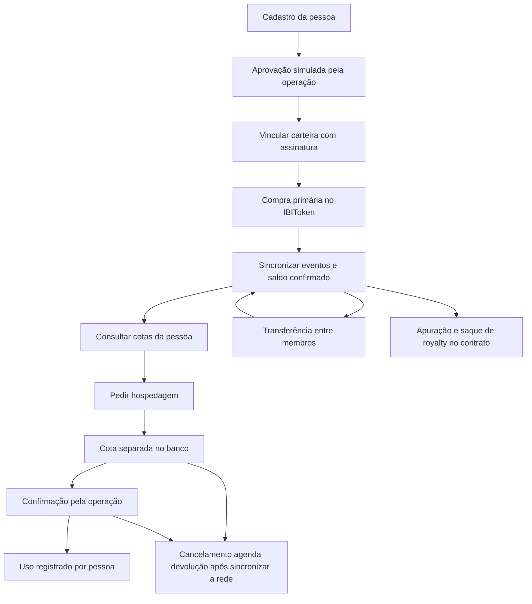

# 10 · Implementação do modelo por pessoa — atualização 11/09/2026

Esta revisão incorpora a documentação produzida pelo Claude no diretório `ibiti-token/documentacao` e aplica o pedido do usuário neste repositório (`ibiti-glamping-g01`). A skill correspondente foi instalada em `~/.codex/skills/ibiti-context/`. O diretório antigo e a skill do Claude foram preservados.

## Resultado e divisão de responsabilidades

| Camada | Implementação / situação |
|---|---|
| Contrato IBIToken | ERC-20 v2 publicado na Sepolia sem contadores de resgate; integração aceita a v1 publicada sem consumo legado e o evento de recuperação da v2 |
| Identidade no protótipo | CPF válido sintaticamente, pseudonimizado por HMAC, pessoa única, aprovação administrativa simulada |
| Prova da carteira | desafio assinado, com domínio, rede, nonce, prazo e uso único; carteira vinculada exclusivamente à pessoa |
| Cotas por pessoa | saldo agregado das carteiras + direitos livres no livro de cotas; histórico de uso permanece com a pessoa |
| Hospedagens | solicitar, confirmar, concluir, cancelar e remarcar; persistência SQLite e idempotência |
| Integração blockchain | eventos reais, bloco consistente e deduplicação; Sepolia usa finalização e bloqueio durante movimentações pendentes |
| Interface | `offchain/public/`, atendimento assistido e login por carteira, sem voucher ou transação para hospedagem |
| Royalties | consulta do devido/pago; reporte e saque permanecem no contrato e scripts administrativos |
| Integrações reais IBITI | KYC/critério ético, custódia, hotel/calendário, atendimento, pagamento fiat, apuração contábil e benefícios: pendentes do parceiro |
| Publicação Sepolia | IBIToken v2 publicado pelo Remix em 11/09/2026: `0xaA6C2902A7f50Dd8C4E8a68de67EA97817Aac030`, bloco 11684811; 150 IBT, código conferido e correspondência exata no Sourcify |

## Fluxo vigente

Não há chamada a `markRedeemed` entre G e J. O saldo do ERC-20 permanece igual. IDs de pedidos e eventos são identificadores técnicos de registros; não representam identidade de tokens individuais.

## Política de cotas confirmada em 11/09/2026

O responsável do projeto confirmou a política implementada: uma experiência por IBT por toda a emissão, sem renovação periódica. Transferências carregam até a quantidade transferida de direitos ainda livres, nunca recriam os já consumidos. Reservas em aberto mantêm seus direitos com a pessoa solicitante. A especificação completa está em [offchain/README.md](../offchain/README.md#política-de-cotas-implementada). Mudança de regra em banco com histórico exige migração explícita.

A experiência definida pelo projeto inclui 3 noites de hospedagem e até 5 pessoas no total, com os serviços comuns do local escolhido. Cancelamentos elegíveis restituem a mesma cota após conciliação; prazo e tratamento de cancelamento tardio/no-show estão em definição. O backend ainda não impõe a duração, o número de hóspedes ou a antecedência. As condições comerciais não devem ser descritas como validações já entregues no software.

A exigência de saldo ao confirmar/usar não bloqueia a movimentação do token on-chain. Se a pessoa transferir saldo necessário para sustentar seus pedidos, novos usos ficam indisponíveis até cancelamento ou regularização. Não afirmar que uma reserva “trava” tokens.

## Pontos corrigidos em relação aos documentos antigos

- Resgate on-chain passou a ser histórico; novo serviço não cria voucher, NFT nem estado por token.
- A hospedagem é consumida no cadastro da pessoa. Trocar/reemitir carteira não zera uso nem concede emissão nova.
- Teto on-chain é **por carteira**; agregação off-chain detecta mais de 20 por pessoa e bloqueia hospedagens. A emissão/transferência direta no contrato ainda pode ultrapassar o agregado pessoal — o contrato não conhece CPF.
- `isMember` das versões 1 e 2 começa na posse, inclusive antes de `validFrom`. O serviço aplica `validFrom` para hospedagem; não confundir membership com início do uso.
- As versões 1 e 2 limitam a oito reportes, mas não bloqueia reportes antecipados ou posteriores ao prazo. O calendário semestral é controle operacional; os documentos não devem afirmar que essa trava já existe on-chain.
- “Sem queima” significa sem queima por hospedagem. A recuperação usa burn/mint de igual quantidade, preservando supply.
- O código local não atualiza contratos publicados. IBX encontrado em Sepolia é outro ativo; a demonstração agora usa o IBIToken publicado em 11/09, registrado no roteiro de Sepolia.
- O IBIToken tem **150 IBT**. O contrato auxiliar tBRL tem saldo fictício para testar royalties; cunhar tBRL não altera IBT nem cotas de hospedagem.
- Aprovação simulada e assinatura não constituem KYC real. Reserva de demonstração não representa hospedagem confirmada pelo hotel.

## Artefatos e rastreabilidade

Fontes HTML da landing e do board, glossário e catálogo do guia foram ajustados para pedido de hospedagem e cadastro pessoal. SVGs/PNGs anteriores são **exportações históricas da v1**, identificadas no guia; ainda não foram regeneradas. O whitepaper revisado está em [whitepaper/whitepaper_ibiti_revisado.md](../whitepaper/whitepaper_ibiti_revisado.md). O BPMN oficial ainda precisa incorporar o fluxo no repositório acadêmico.

Execução, endpoints, política, persistência e limitações: [manual do serviço](../offchain/README.md). Rede e publicação: [registro de Sepolia](../smart-contract/docs/deploy-modelo-pessoa.md). Testes: [relatório desta revisão](11-validacao.md).

**Cancelamento durante transferência pendente:** registra imediatamente o cancelamento, mas a cota fica em devolução até a sincronização cobrir esse instante. Transferências são processadas antes da devolução, para que o reembolso permaneça na origem. Essa regra também vale quando o RPC está indisponível.

## Migração técnica para Remix (11/09)

Remix é a ferramenta de compilação, testes Solidity e operação. A demonstração Node usa solc e Anvil, sem Hardhat. O backend reconhece as assinaturas dos eventos `Reissued` da v1 e da v2; qualquer `RedemptionMarked` legado bloqueia sincronização até migração explícita. Alterar o fonte ou gerar o pacote Remix não atualiza o endereço Sepolia.
