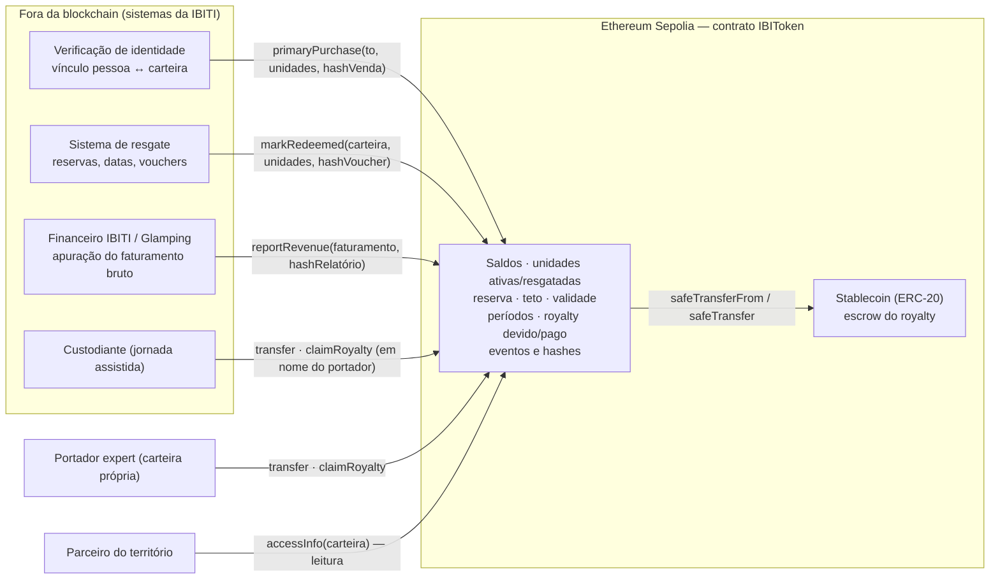
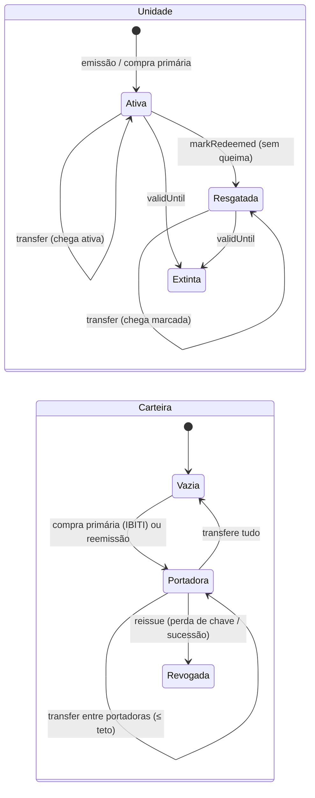
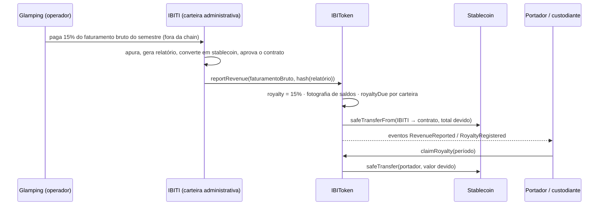

# IBIToken — Implementação do Contrato Inteligente ERC-20 (versão 1)

> **Artefato:** Implementação do Contrato Inteligente ERC-20 — versão 1 (primeira de duas entregas)
> **Módulo:** ADMD7 — Blockchain, criptomoedas e tokenização de ativos · Inteli
> **Projeto parceiro:** IBITI (Ibiti Projeto) — tokenização do IBITI Glamping · **Grupo G01**
> **Base conceitual:** Whitepaper Técnico do Ativo Digital (Sprint 2) e artefato Riscos Éticos e Impacto (Sprint 2)

Este diretório contém o contrato inteligente **IBIToken**, seus testes automatizados, um fluxo de
demonstração executável e os módulos de deploy para a rede de testes **Sepolia** — a representação
programável, em ambiente EVM, do ativo digital modelado pelo grupo no whitepaper.

O entendimento econômico e jurídico do ativo **ainda está em construção**: números, meio de pagamento
dos royalties e enquadramento regulatório seguem provisórios. Isso está declarado, ponto a ponto, em
[`docs/premissas-e-pendencias.md`](docs/premissas-e-pendencias.md). A dimensão **técnica**, por outro
lado, é completa: o contrato compila, é coberto por **50 testes automatizados**, executa um fluxo de
ponta a ponta e é reproduzível a partir de [`docs/guia-de-execucao.md`](docs/guia-de-execucao.md).

---

## 1. O ativo em uma tabela

| Parâmetro | Valor na v1 | Origem no whitepaper |
|---|---|---|
| Nome · símbolo | **IBIToken · IBT** (símbolo é proposta; nomenclatura oficial em aberto — D13) | §3.1, Apêndice A |
| Padrão | **ERC-20** (OpenZeppelin 5.6) **sem casas decimais** — token indivisível | §4.3, §10.3 |
| Faces reunidas em cada unidade | experiência (utility) + Passaporte IBITI (membership) + fração do royalty | §3.1 |
| Emissão | **única, no deploy: 150 unidades** (parâmetro imutável; hipótese ilustrativa do valuation) | §4.2, Apêndice B |
| Reserva da IBITI | **50 unidades (1/3 do supply = 5 dos 15 pontos do royalty)**, fora de venda salvo decisão expressa | §6.1, §9.4 |
| Unidades à venda | 100 (captação máxima ≈ R$ 5,3 mi a R$ 53.008,93/unidade — hipótese) | §4.2 |
| Teto por carteira | **20 unidades (2/15 do supply = 2 dos 15 pontos)**; carteira administrativa isenta | §9.2, §11.2 |
| Validade | **4 anos**: 2027‑01‑01 00:00 UTC → 2030‑12‑31 23:59:59 UTC (parâmetros do deploy) | §4.4, §5.3 |
| Royalty | **15% do faturamento bruto** do Glamping (diárias + consumo), 100% tokenizado, **8 apurações semestrais** | §6.1, §6.2 |
| Resgate | marcação on‑chain **sem queima** (contadores de unidades ativas/resgatadas por carteira) | §4.4, §10.3 |
| Transferência | só para carteira que **já tem saldo**; porta de entrada única = compra primária pela IBITI | §9.2, §9.4 (decisão para a v1, ver §7) |
| Pagamento do royalty | registro on‑chain do valor devido por carteira + **saque em stablecoin** (quando configurada) ou liquidação em reais fora da chain | §6.2, §10.6 (D9 em aberto) |
| Governança | **administração única da IBITI** (carteira administrativa); troca em dois passos; renúncia desabilitada | §8, D13 |
| Rede | **Sepolia** para desenvolvimento e testes (ambiente simulado, restrição do TAPI); mainnet como rede definitiva futura | §10.2 |

---

## 2. Do whitepaper ao código: regra de negócio → regra computacional

A tabela abaixo é a versão executável da tabela 9.4 do whitepaper. Cada linha aponta o mecanismo do
contrato ([`contracts/IBIToken.sol`](contracts/IBIToken.sol)) e o teste que a comprova
([`test/IBIToken.ts`](test/IBIToken.ts)). O detalhamento completo, com diagramas, está em
[`docs/regras-de-negocio-para-contrato.md`](docs/regras-de-negocio-para-contrato.md).

| Regra de negócio (decisão do grupo) | Regra no contrato | Onde está / como falha |
|---|---|---|
| Emissão única com teto; sem novas levas no piloto | Todo o supply é cunhado no `constructor` para a carteira administrativa; **não existe função de mint nem de burn** | `emissionCap` imutável · evento `Emission` · teste "Emissão única" |
| Só apoiadores verificados pela IBITI entram | `primaryPurchase(to, units, saleRef)` restrita à carteira administrativa; uma carteira **sem saldo só recebe da carteira administrativa** | erro `RecipientNotHolder` · `OwnableUnauthorizedAccount` |
| Transferência entre portadores, sem lista no contrato | `transfer`/`transferFrom` padrão ERC‑20 + travas em `_update`: destino com saldo > 0, teto por carteira, validade, carteiras revogadas | erros `RecipientNotHolder`, `WalletCapExceeded`, `TokenExpired`, `WalletRevoked` |
| Nenhuma carteira concentra o fluxo (2/15 do supply) | `maxPerWallet = emissionCap × 2 / 15`, verificado em compra primária, transferência e reemissão; carteira administrativa isenta | erro `WalletCapExceeded(wallet, resultante, teto)` |
| IBITI retém 5 dos 15 pontos (1/3 dos tokens) | `reservedUnits = emissionCap / 3`: a carteira administrativa não desce abaixo da reserva; só `reduceReserve` (decisão expressa) a diminui | erro `ReserveProtected` · evento `ReserveReduced` |
| Experiência usada, token mantido | `markRedeemed(holder, units, voucherRef)` move unidades de *ativas* para *resgatadas*; saldo e supply não mudam | `activeUnitsOf` / `redeemedUnitsOf` · evento `RedemptionMarked` |
| Resgate único por unidade | só unidades ativas podem ser marcadas; token indivisível (`decimals() = 0`) | erro `InsufficientActiveUnits(holder, ativas, pedidas)` |
| Token resgatado transfere normalmente, sem gasto duplo | a transferência move primeiro unidades ativas e depois resgatadas, que chegam ao destino já marcadas | evento `UnitsMoved(from, to, ativas, resgatadas)` |
| Passaporte = posse; benefício verificável por parceiros | `accessInfo(carteira)` → saldo, ativas, resgatadas, membro, expirado; `isMember` = saldo > 0 ∧ não revogada ∧ dentro da validade | consulta pública, sem dado pessoal |
| Royalty = 15% do faturamento bruto, rateado por posse | `reportRevenue(faturamentoBruto, hashRelatorio)`: calcula 15%, fotografa os saldos e registra `royaltyDue[período][carteira] = royalty × saldo ÷ supply` | evento `RevenueReported` + `RoyaltyRegistered` por carteira |
| Oito apurações semestrais em quatro anos | `TOTAL_PERIODS = 8`, reportadas em ordem; a 9ª é rejeitada | erro `AllPeriodsReported(8)` |
| Reporte assinado pela IBITI, com hash do relatório | só a carteira administrativa reporta; o hash fica no evento e em `periodInfo(período)` | `OwnableUnauthorizedAccount` |
| Pagamento em stablecoin (direção D9) ou em reais | com stablecoin configurada, o total devido é **depositado no contrato na mesma transação do reporte** e cada portador saca com `claimRoyalty(período)`; sem stablecoin, a IBITI registra o pagamento bancário com `settleOffChain` | erros `PeriodNotOnChain`, `PeriodOnChain`, `NothingToClaim` |
| Validade de quatro anos para token e experiência | `validFrom`/`validUntil` imutáveis: resgates só dentro da janela; transferências rejeitadas após o fim; `isMember` passa a `false` | erros `TokenNotYetValid`, `TokenExpired` |
| Perda de chave / sucessão não elimina o membership | `reissue(antiga, nova)`: queima e recunha o saldo na nova carteira, leva contadores e royalties pendentes, **revoga** a antiga | evento `Reissued` · erro `WalletRevoked` |
| Administração única da IBITI | `onlyOwner` em todas as funções administrativas; `Ownable2Step` para troca da carteira; `renounceOwnership` desabilitada | erro `RenounceDisabled` |
| Pausa de emergência (recomendada em §9.1) | `pause()`/`unpause()` congelam transferências, compras, resgates, reportes e saques | erro `EnforcedPause` |
| Termos não mudam depois da venda (§8.3) | supply, reserva inicial, teto, validade e alíquota são `immutable`/`constant`; só o administrador (2 passos), a stablecoin (uma única vez) e a **redução** da reserva são ajustáveis | — |

---

## 3. Arquitetura da solução

### 3.1 On‑chain e off‑chain (§10.4 do whitepaper)



O contrato guarda apenas **endereços, quantidades, valores agregados e hashes**. Identidade, reservas,
vouchers e relatórios completos ficam fora da chain — requisito de privacidade do perfil de hóspede
(§2.1, §11.3) e de LGPD (Riscos Éticos §2.5).

### 3.2 Ciclo de vida de uma unidade e de uma carteira



### 3.3 Fluxo do royalty (§6.2 / §6.3)



---

## 4. Interface do contrato

**Funções administrativas** (somente a carteira administrativa da IBITI = `owner`)

| Função | Regra de negócio | Eventos |
|---|---|---|
| `primaryPurchase(to, units, saleRef)` | compra primária após verificação fora da chain; única porta de entrada | `PrimaryPurchase`, `Transfer`, `UnitsMoved` |
| `markRedeemed(holder, units, voucherRef)` | experiência consumida, sem queima | `RedemptionMarked` |
| `reportRevenue(grossRevenue, reportHash)` | reporte semestral assinado; cálculo e registro pro‑rata; depósito em stablecoin | `RevenueReported`, `RoyaltyRegistered` |
| `settleOffChain(period, holder, paymentRef)` | registra pagamento em reais (períodos sem stablecoin) | `RoyaltySettledOffChain` |
| `reissue(oldWallet, newWallet)` | perda de chave / sucessão | `Reissued`, `Transfer` ×2 |
| `reduceReserve(newReserve)` | decisão expressa de liberar parte da reserva | `ReserveReduced` |
| `setStablecoin(address)` | define o meio de pagamento (uma única vez) | `StablecoinSet` |
| `pause()` / `unpause()` | emergência | `Paused` / `Unpaused` |
| `transferOwnership(new)` → `acceptOwnership()` | troca da carteira administrativa em dois passos | `OwnershipTransferStarted`, `OwnershipTransferred` |

**Portador** (jornada expert: a própria carteira; jornada assistida: o custodiante em seu nome)

| Função | Regra |
|---|---|
| `transfer(to, units)` / `approve` / `transferFrom` | ERC‑20 padrão + travas (§2) |
| `claimRoyalty(period)` | saca em stablecoin o royalty registrado para a carteira no período |

**Consultas públicas** (qualquer pessoa, sem custo de gas)

`accessInfo(carteira)` · `isMember` · `activeUnitsOf` · `redeemedUnitsOf` · `balanceOf` · `revoked` ·
`holders()` · `holderCount()` · `saleableUnits()` · `reservedUnits` · `maxPerWallet` · `emissionCap` ·
`validFrom` · `validUntil` · `isExpired()` · `lastReportedPeriod` · `periodInfo(período)` ·
`royaltyDue(período, carteira)` · `royaltyPaid(período, carteira)` · `pendingRoyaltyOf(carteira)` ·
`stablecoin` · `owner()` · `paused()`.

A lista completa de erros personalizados (as "travas") está no próprio contrato e na
[tabela de regras](docs/regras-de-negocio-para-contrato.md#4-erros-travas-e-o-que-significam).

---

## 5. Decisões técnicas e justificativas

1. **ERC‑20 estendido, não ERC‑721.** O grupo confirmou o ERC‑20 (§10.3). Um ERC‑20 puro não distingue
   unidade resgatada de não resgatada; a extensão com **dois contadores por carteira** (`saldo = ativas +
   resgatadas`) registra o consumo da experiência preservando a interface padrão, a fungibilidade para o
   cálculo do royalty e a indivisibilidade (`decimals() = 0`). Identificadores individuais (vouchers)
   ficam no sistema de resgate da IBITI, como decidido em D5/D10.
2. **Porta de entrada pelo saldo, sem lista no contrato.** Implementa a regra "destino precisa ter saldo
   > 0; só a carteira administrativa cria portadores" (§9.2/§9.4, D10). O whitepaper também descreve uma
   "lista de carteiras aprovadas" em outras seções — a v1 adota a regra do saldo por decisão registrada em
   02/09/2026; o texto do whitepaper precisa ser harmonizado (ver [pendências](docs/premissas-e-pendencias.md)).
   A verificação em `_update` fica em uma única função (`_enforceTransferRules`), então trocar para uma
   lista explícita na v2 é uma mudança local.
3. **Emissão no deploy, sem mint/burn.** "Emitir leva" é a própria transação de deploy: única por
   construção, com teto imutável. Não existe `mint` nem `burn` na interface — a expiração é por data, não
   por destruição (§10.3), e a escassez não pode ser alterada depois da venda (§8.3).
4. **Reemissão como queima + cunhagem.** `reissue` destrói o saldo da carteira comprometida e recria a
   mesma quantidade na nova (supply constante), levando contadores e royalties pendentes e **revogando**
   a antiga. É literalmente uma reemissão e não passa pelas regras de transferência entre portadores;
   nunca coexistem dois saldos válidos para o mesmo direito (§10.5).
5. **Fotografia de saldos no reporte.** A "data de corte" (§6.2) é o momento em que a IBITI publica o
   semestre: o contrato percorre o registro de portadores e grava o valor devido por carteira. O laço é
   limitado pelo próprio supply (no máximo 150 carteiras com saldo), o que mantém o custo previsível.
6. **Pagamento por saque (pull), não por envio em lote (push).** Com stablecoin configurada, o total
   devido é depositado no contrato **na mesma transação do reporte** ("reporte assinado e depósito
   tornam‑se um único fluxo", §6.3) e cada portador saca o que lhe cabe. O padrão pull evita que um único
   endereço problemático bloqueie a distribuição de todos e faz cada carteira pagar o próprio gas; na
   jornada assistida, o custodiante saca em nome do portador. O whitepaper (§9.1) descreve o envio
   automático — a diferença está registrada como decisão da v1 a validar pelo grupo.
7. **Reporte com hash do relatório.** Segue §6.3: o valor agregado do semestre e o hash do relatório
   ficam on‑chain; o relatório não. Qualquer portador que receba o documento confere a integridade;
   nenhum dado individual de hóspede vai à blockchain (Riscos Éticos §2.5).
8. **Parâmetros econômicos imutáveis.** Supply, teto por carteira, validade e alíquota são `immutable`
   ou `constant`; a reserva só pode **diminuir** por decisão expressa (`reduceReserve`), nunca aumentar.
   É a tradução da salvaguarda de §8.3 ("alterá‑los depois da venda equivaleria a mudar os termos do que
   já foi vendido").
9. **Administração única com proteção contra erro humano.** `Ownable2Step` exige que a nova carteira
   administrativa aceite o cargo (evita transferir o controle para um endereço digitado errado) e
   `renounceOwnership` está desabilitada (um contrato sem administrador deixaria resgates, reportes e
   reemissões impossíveis). O risco de chave única (§11.3) permanece e está documentado.
10. **Pausa de emergência.** Recomendada e ainda não decidida no whitepaper (§9.1); adotada na v1 por ter
    custo baixo e ser prática padrão em contratos com valor real (Riscos Éticos §2.4). Cabe ao grupo
    ratificar ou remover.
11. **Stablecoin definida uma única vez.** Períodos reportados antes da configuração seguem liquidados em
    reais (`settleOffChain`); os posteriores, em stablecoin. Trocar de stablecoin exigiria migrar fundos
    em custódia — fora do escopo da v1.
12. **OpenZeppelin 5.6 como base.** `ERC20`, `ERC20Pausable`, `Ownable2Step`, `SafeERC20` e
    `ReentrancyGuard` são componentes auditados e amplamente usados; toda a lógica de negócio do IBITI
    está em código próprio, comentado em português, sobre essa base.

---

## 6. Segurança e limitações conhecidas

- **Confiança na IBITI.** O contrato não enxerga o caixa do Glamping (§6.3): o faturamento é informado
  pela carteira administrativa, que também administra o contrato (§7.2, §11.3). A v1 registra o hash do
  relatório e todos os eventos, mas não substitui um auditor externo ou uma segunda assinatura — evolução
  prevista no roadmap (§13).
- **Chave administrativa única.** Perder ou comprometer a chave da IBITI é o maior risco operacional
  (§9.2). Recomendação para o piloto: carteira de hardware dedicada e, na v2, avaliar multiassinatura.
- **Sem auditoria formal.** Os 50 testes cobrem as regras de negócio e os casos de erro previstos; uma
  auditoria de segurança independente é etapa 3 do roadmap e pré‑requisito para qualquer uso real.
- **Custo de gas.** Cada reporte percorre todas as carteiras com saldo (≤ 150). Em Sepolia o custo é
  irrelevante; em mainnet precisa entrar no planejamento (§10.6). As estatísticas de gas dos testes estão
  em [`docs/relatorio-de-testes.md`](docs/relatorio-de-testes.md).
- **Datas dos semestres não são verificadas on‑chain.** O contrato garante a ordem e o máximo de oito
  apurações; a periodicidade é responsabilidade operacional do financeiro da IBITI (simplificação
  declarada).
- **Unidade de conta.** Os valores de faturamento e royalty são inteiros na menor unidade da stablecoin
  configurada (ex.: 6 casas) ou, sem stablecoin, em centavos de real — convenção documentada, não
  verificada pelo contrato.

---

## 7. Testes

```bash
npm test
```

Cobertura por bloco (50 casos, todos aprovados — saída completa em
[`docs/relatorio-de-testes.md`](docs/relatorio-de-testes.md)):

| Bloco | O que comprova |
|---|---|
| Emissão única (deploy) | metadados, supply/reserva/teto derivados, evento `Emission`, ausência de mint/burn, parâmetros inválidos |
| Compra primária | porta de entrada, permissão, teto de 20, proteção da reserva (100 à venda), redução da reserva |
| Transferências entre portadores | saldo > 0 como critério, `transferFrom` por custodiante, teto no secundário, devolução à IBITI, registro de portadores |
| Resgate | marcação sem queima, resgate único por unidade, janela de validade |
| Unidades resgatadas | ordem ativas → resgatadas na transferência, sem gasto duplo |
| Royalties — reporte | 15% do bruto, pro‑rata por fotografia, depósito em stablecoin, allowance, 8 períodos, semestre zero |
| Royalties — saque | pull por portador, reserva da IBITI, períodos inexistentes, `pendingRoyaltyOf` |
| Royalties — fora da chain | registro sem stablecoin, `settleOffChain`, stablecoin definida uma única vez |
| Reemissão | migração de saldo, contadores e royalties; revogação; validações |
| Validade | bloqueios após expiração; último semestre e saques ainda possíveis |
| Pausa | congelamento total e retomada |
| Administração | troca em dois passos com entrega da reserva; renúncia desabilitada |
| Invariantes | soma dos saldos = supply; resgatadas ≤ saldo; registro = carteiras com saldo; soma dos devidos = total do período |

---

## 8. Como executar (resumo)

Requisitos: **Node.js 22+** (testado com 24) e npm. Passo a passo completo, incluindo deploy na Sepolia,
verificação do código e uso pelo Remix/Etherscan, em [`docs/guia-de-execucao.md`](docs/guia-de-execucao.md).

```bash
cd smart-contract
npm install          # dependências (Hardhat 3, OpenZeppelin 5, ethers 6)
npm run build        # compila os contratos (solc 0.8.34)
npm test             # 50 testes automatizados
npm run demo         # fluxo narrado de ponta a ponta na rede simulada
npm run deploy:local # deploy via Hardhat Ignition na rede simulada
```

---

## 9. Estrutura do diretório

```
smart-contract/
├── contracts/
│   ├── IBIToken.sol                   # o contrato (ERC-20 estendido, comentado em português)
│   └── mocks/MockStablecoin.sol       # stablecoin de teste (tBRL) para local/Sepolia
├── test/IBIToken.ts                   # 50 testes (mocha + ethers + chai matchers)
├── scripts/
│   ├── demo-flow.ts                   # fluxo completo narrado (rede simulada)
│   └── operate-sepolia.ts             # operar um contrato implantado (status, compra, resgate, reporte, reemissão)
├── ignition/modules/
│   ├── IBIToken.ts                    # deploy de referência (parâmetros do whitepaper)
│   └── IBITokenSepoliaDemo.ts         # deploy de demonstração (com stablecoin de teste)
├── docs/
│   ├── regras-de-negocio-para-contrato.md   # mapa detalhado whitepaper → contrato, diagramas, erros
│   ├── guia-de-execucao.md                  # instalação, testes, deploy Sepolia, verificação, Remix
│   ├── premissas-e-pendencias.md            # o que é hipótese, o que diverge no whitepaper, v2
│   └── relatorio-de-testes.md               # saída dos testes e estatísticas de gas
├── hardhat.config.ts · package.json · tsconfig.json · .env.example
```

---

## 10. Premissas, pendências e próximos passos

O que esta versão **assume** (e por quê), o que o grupo ainda precisa **decidir**, as **inconsistências
do whitepaper** que a implementação expôs e o escopo previsto para a **versão 2** estão em
[`docs/premissas-e-pendencias.md`](docs/premissas-e-pendencias.md). Em resumo: harmonizar a regra de
transferência no whitepaper, ratificar o pagamento por saque e a pausa, fechar a stablecoin e o
custodiante, validar os números do valuation com a IBITI e submeter o contrato a testes de segurança
(etapas 1–3 do roadmap, §13).
