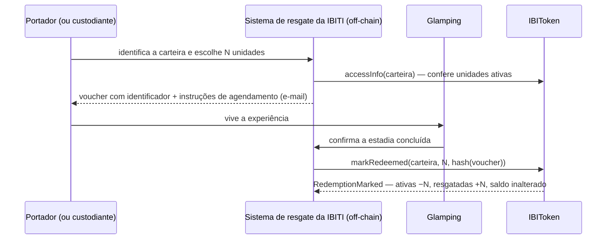

# Regras de negócio → regras computacionais — IBIToken v1

Este documento detalha a ponte entre o whitepaper (Sprint 2, sobretudo as seções 3, 4, 5, 6, 8, 9 e 10)
e o contrato [`contracts/IBIToken.sol`](../contracts/IBIToken.sol). Ele complementa a tabela‑resumo do
[README](../README.md#2-do-whitepaper-ao-código-regra-de-negócio--regra-computacional).

## 1. Modelo mental em três frases

1. **Uma unidade, três faces.** Cada IBIToken é uma unidade inteira (sem decimais) que reúne experiência,
   Passaporte IBITI e fração do royalty. As três faces nascem juntas na compra e viajam juntas na
   transferência; a experiência é a única que "se gasta", e mesmo assim o token permanece.
2. **Dois contadores por carteira.** `saldo = ativas + resgatadas`. O saldo é o ERC‑20 padrão; o contrato
   apenas sabe quantas unidades daquela carteira ainda têm experiência disponível.
3. **Uma carteira administrativa.** A IBITI é a única parte com poderes administrativos (D13). Ela
   cria portadores (compra primária), marca resgates, reporta receita, reemite por perda de chave, pode
   pausar e pode reduzir a própria reserva. Tudo o mais é dos portadores (transferir, sacar) ou de qualquer
   pessoa (consultar).

## 2. Funções do whitepaper (§9.1) e sua implementação

| Função no whitepaper | Solidity | Quem executa | Travas verificadas | Eventos |
|---|---|---|---|---|
| **Emitir leva** — cria as unidades com teto fixo e validade de quatro anos, uma única vez | `constructor(admin, emissionCap, validFrom, validUntil, stablecoin)` — cunha `emissionCap` unidades para `admin`; deriva `reservedUnits = cap/3` e `maxPerWallet = cap×2/15` | quem faz o deploy (a própria IBITI ou um operador técnico, informando a carteira administrativa) | `cap ≥ 15`; `validUntil > validFrom`; `admin ≠ 0` | `Emission`, `Transfer(0 → admin)`, `StablecoinSet` (se informada) |
| **Compra primária** — única forma de uma carteira sem saldo receber tokens | `primaryPurchase(to, units, saleRef)` | carteira administrativa | `units > 0`; pausa; validade; `to` não revogada; teto por carteira; reserva da IBITI intocada | `PrimaryPurchase`, `Transfer`, `UnitsMoved` |
| **Transferir** — só para destino com saldo, sem ultrapassar o teto; move ativas antes de resgatadas | `transfer` / `approve` + `transferFrom` (ERC‑20) com regras em `_update` | portador (jornada expert) ou custodiante autorizado via `approve` (jornada assistida) | pausa; validade; origem/destino não revogados; destino com saldo > 0 (exceto se origem ou destino é a carteira administrativa); teto; reserva (se origem é a administrativa); saldo suficiente | `Transfer`, `UnitsMoved` |
| **Marcar resgate** — converte N unidades ativas em resgatadas, sem destruir | `markRedeemed(holder, units, voucherRef)` | carteira administrativa, após o voucher do sistema de resgate | `units > 0`; pausa; `validFrom ≤ agora ≤ validUntil`; carteira não revogada; `units ≤ ativas` | `RedemptionMarked` |
| **Verificar acesso** — saldo, unidades ativas e situação, para qualquer endereço | `accessInfo(account)`, `isMember`, `activeUnitsOf`, `redeemedUnitsOf`, `balanceOf` | qualquer pessoa (leitura) | — | — |
| **Reportar receita** — registra o royalty do período e o hash do relatório; dispara o cálculo por carteira | `reportRevenue(grossRevenue, reportHash)` | carteira administrativa | pausa; `lastReportedPeriod < 8`; se stablecoin configurada, allowance/saldo da IBITI suficientes | `RevenueReported`, `RoyaltyRegistered` (uma por carteira) |
| **Registrar / distribuir royalty** — valor devido por carteira; pagamento em stablecoin ou fora da chain | registro: dentro de `reportRevenue` (`royaltyDue[período][carteira]`); pagamento on‑chain: `claimRoyalty(período)` (saque pelo portador); pagamento em reais: `settleOffChain(período, carteira, comprovanteRef)` | contrato (registro) · portador/custodiante (saque) · carteira administrativa (liquidação em reais) | período reportado; período on‑chain/off‑chain conforme o caso; carteira não revogada; valor pendente > 0 | `RoyaltyClaimed` · `RoyaltySettledOffChain` |
| **Reemitir por perda ou sucessão** — transfere o saldo para nova carteira e invalida a anterior | `reissue(oldWallet, newWallet)` | carteira administrativa, após processo fora da chain | pausa; `oldWallet` com saldo, diferente da administrativa; `newWallet ≠ 0`, não revogada, dentro do teto | `Reissued`, `Transfer(old → 0)`, `Transfer(0 → new)` |
| **Pausar** (recomendada, §9.1) | `pause()` / `unpause()` | carteira administrativa | — | `Paused` / `Unpaused` |
| **Ajustar parâmetros** (recomendada, §9.1) | apenas `reduceReserve(novaReserva)` (só diminui), `setStablecoin(endereço)` (uma vez) e a troca da carteira administrativa (`transferOwnership` + `acceptOwnership`) | carteira administrativa | ver §7 deste documento | `ReserveReduced`, `StablecoinSet`, `OwnershipTransferStarted/Transferred` |

## 3. Travas (§9.2) — como o contrato as verifica

| Trava do whitepaper | Verificação no código |
|---|---|
| Teto de emissão por leva | não existe `mint`; o supply é cunhado uma vez no `constructor` e `emissionCap` é `immutable` |
| Validade de quatro anos | `validFrom`/`validUntil` imutáveis; `markRedeemed` exige a janela; `_update` rejeita transferências após `validUntil`; `isMember` devolve `false` após a expiração; os saldos permanecem como histórico |
| Resgate por unidade e sem repetição | `units ≤ activeUnitsOf(holder)`; unidades já resgatadas nunca voltam a ser ativas, nem quando transferidas |
| Transferência apenas para portadores | em `_update`: se o destino não é a carteira administrativa e a origem também não, `balanceOf(destino) > 0` é obrigatório |
| Limite de posse por carteira | `balanceOf(destino) + valor ≤ maxPerWallet` em compra primária, transferência e reemissão; a carteira administrativa é isenta |
| Permissões de administração | `onlyOwner` (OpenZeppelin) nas funções administrativas; qualquer outro endereço recebe `OwnableUnauthorizedAccount` |

## 4. Erros (travas) e o que significam

| Erro | Quando ocorre | Regra de negócio por trás |
|---|---|---|
| `RecipientNotHolder(to)` | transferência para carteira sem saldo que não é a administrativa | só entra no ecossistema quem passou pela compra primária (verificação da IBITI) |
| `WalletCapExceeded(wallet, resultante, teto)` | a carteira ficaria acima de 2/15 do supply | nenhuma carteira concentra o fluxo (Riscos Éticos §2.3) |
| `ReserveProtected(saldoRestante, reserva)` | a carteira administrativa tentaria descer abaixo da reserva | 5 dos 15 pontos ficam com a IBITI salvo decisão expressa (`reduceReserve`) |
| `WalletRevoked(wallet)` | carteira invalidada por reemissão tenta operar ou receber | nunca dois saldos válidos para o mesmo direito |
| `TokenExpired(validUntil)` | transferência ou resgate depois do fim dos 4 anos | as três faces se extinguem com o prazo |
| `TokenNotYetValid(validFrom)` | resgate antes do início da validade | a experiência só existe com o Glamping em operação |
| `InsufficientActiveUnits(holder, ativas, pedidas)` | resgatar mais unidades do que as ativas | resgate único por unidade |
| `ZeroUnits()` | compra primária ou resgate de zero unidades | operação sem efeito não é registrada |
| `AllPeriodsReported(8)` | nono reporte | oito apurações semestrais em quatro anos |
| `PeriodNotReported(p)` | consulta/saque de período ainda não reportado | o royalty só existe depois do reporte assinado |
| `PeriodNotOnChain(p)` / `PeriodOnChain(p)` | saque em período liquidado em reais / liquidação em reais de período pago em stablecoin | cada período tem um único meio de pagamento |
| `NothingToClaim(p, holder)` | nada pendente para a carteira no período | a fotografia de saldos define quem recebe |
| `StablecoinAlreadySet(atual)` | segunda configuração de stablecoin | trocar o meio de pagamento exigiria migrar fundos — fora da v1 |
| `InvalidReserve(pedida, atual)` | tentativa de aumentar (ou manter) a reserva | a reserva só diminui |
| `NothingToReissue(wallet)` | reemissão de carteira sem saldo | não há o que reemitir |
| `InvalidAddress()` / `InvalidEmissionCap(cap)` / `InvalidValidity(de, até)` | parâmetros inválidos | consistência da emissão |
| `RenounceDisabled()` | tentativa de renunciar à administração | sem administrador não há resgate, reporte nem reemissão |
| `OwnableUnauthorizedAccount(conta)` · `EnforcedPause()` · `ERC20InsufficientBalance` · `ERC20InsufficientAllowance` | erros padrão do OpenZeppelin | permissão única da IBITI · pausa · saldo/allowance ERC‑20 |

## 5. Eventos (§9.3) — a trilha de auditoria

| Evento | Campos | Para que serve |
|---|---|---|
| `Emission` | admin, teto, reserva, teto por carteira, validade | prova pública dos termos da emissão |
| `PrimaryPurchase` | destino, unidades, hash da venda | registro da entrada de cada apoiador (sem dado pessoal) |
| `Transfer` (ERC‑20) + `UnitsMoved` | origem, destino, unidades ativas e resgatadas movidas | histórico de posse legível por carteiras e exploradores; o segundo evento diz **o que** foi transferido |
| `RedemptionMarked` | carteira, unidades, hash do voucher, ativas restantes | comprova o consumo da experiência e liga ao voucher do sistema da IBITI |
| `RevenueReported` | período, faturamento bruto, royalty, hash do relatório, supply, carteiras, on‑chain? | reporte assinado pela IBITI; qualquer pessoa refaz o cálculo |
| `RoyaltyRegistered` | período, carteira, valor | valor devido a cada carteira na fotografia |
| `RoyaltyClaimed` / `RoyaltySettledOffChain` | período, carteira, valor (+ hash do comprovante) | fechamento do ciclo: cada real distribuído tem registro |
| `Reissued` | carteira antiga, nova, unidades, resgatadas | sucessão / recuperação verificável |
| `ReserveReduced` · `StablecoinSet` · `Paused` · `Unpaused` · `OwnershipTransferStarted` · `OwnershipTransferred` | — | decisões administrativas visíveis a todos |

Nenhum evento contém nome, documento ou qualquer dado pessoal — apenas endereços, quantidades, valores e hashes.

## 6. A regra de transferência, passo a passo (`_update`)

Toda movimentação de unidades passa por `_update`. Para transferências entre carteiras (origem e destino
diferentes de zero e entre si):

1. **Pausa** — se pausado, rejeita (`EnforcedPause`).
2. **Validade** — se `agora > validUntil`, rejeita (`TokenExpired`).
3. **Revogação** — origem ou destino revogados, rejeita (`WalletRevoked`).
4. **Porta de entrada** — se o destino não é a carteira administrativa: exige saldo > 0 no destino, salvo
   quando a origem é a carteira administrativa (compra primária) (`RecipientNotHolder`).
5. **Teto** — se o destino não é a carteira administrativa: `saldo + valor ≤ maxPerWallet` (`WalletCapExceeded`).
6. **Reserva** — se a origem é a carteira administrativa: `saldo − valor ≥ reservedUnits` (`ReserveProtected`).
7. **Contadores** — calcula `ativas = saldo − resgatadas` da origem; se `valor > ativas`, move
   `valor − ativas` unidades resgatadas para o destino (`UnitsMoved(from, to, ativas, resgatadasMovidas)`).
8. **ERC‑20** — atualiza saldos (`Transfer`), rejeitando saldo insuficiente (`ERC20InsufficientBalance`).
9. **Registro de portadores** — inclui o destino se passou a ter saldo; remove a origem se zerou.

Cunhagem (deploy e reemissão) e queima (reemissão) pulam os passos 2–7: são operações administrativas
que não representam uma transferência entre portadores.

## 7. Parâmetros: o que é fixo e o que é ajustável (§8.3)

| Parâmetro | Tipo | Quem pode mudar | Como |
|---|---|---|---|
| Supply (`emissionCap`) | `immutable` | ninguém | — |
| Teto por carteira (`maxPerWallet`) | `immutable` (derivado: 2/15) | ninguém | — |
| Validade (`validFrom`, `validUntil`) | `immutable` | ninguém | — |
| Alíquota (`ROYALTY_BPS` = 15%) e nº de períodos (8) | `constant` | ninguém | — |
| Reserva da IBITI (`reservedUnits`) | estado, inicial = 1/3 | IBITI, só para **reduzir** | `reduceReserve` (evento `ReserveReduced`) |
| Stablecoin de pagamento | estado, definida no deploy ou depois, **uma vez** | IBITI | `setStablecoin` |
| Carteira administrativa (`owner`) | estado | IBITI, em dois passos | `transferOwnership` → `acceptOwnership`; depois a antiga carteira entrega a reserva à nova (`transfer`) |
| Pausa | estado | IBITI | `pause` / `unpause` |

## 8. Royalty: fórmula e exemplo com os números do whitepaper

```
royalty(período)            = faturamentoBruto(período) × 1500 / 10000
devido(período, carteira)   = royalty(período) × saldo(carteira) / supply          (fotografia no reporte)
```

Exemplo (1º semestre de 2027, metade do faturamento bruto projetado em §4.2 do whitepaper, R$ 6.797.476,76):

| Grandeza | Valor |
|---|---|
| Faturamento bruto reportado | R$ 3.398.738,38 |
| Royalty (15%) | R$ 509.810,76 |
| Por unidade (÷ 150) | R$ 3.398,74 — coincide com a tabela 4.5 do whitepaper (1º sem. 2027) |
| Carteira com 20 unidades | R$ 67.974,77 |
| Reserva da IBITI (50) + unidades não vendidas (65) | R$ 390.854,91 |

Unidades já resgatadas continuam contando (§6.2); carteiras revogadas não recebem, e a carteira reemitida
recebe em seu lugar, inclusive os valores pendentes de períodos anteriores.

## 9. Resgate híbrido (D5/D10) — sequência



O contrato não guarda o voucher, só o hash: a ligação entre voucher, reserva e pessoa fica no sistema da
IBITI. Se as unidades já resgatadas forem transferidas, chegam ao destino marcadas — o novo portador não
ganha uma experiência nova (§3.1).

## 10. Reemissão (§5.3 / §10.5) — o que muda em cada estrutura

| Estrutura | Carteira antiga | Carteira nova |
|---|---|---|
| Saldo ERC‑20 | queimado (→ 0) | cunhado (+ unidades) |
| Contadores ativas/resgatadas | zerados | recebem os valores da antiga |
| Royalties pendentes (`royaltyDue`) de períodos já reportados | zerados | somados aos da nova |
| Registro de portadores | removida | incluída |
| `revoked` | `true` (definitivo) | inalterado |
| Próximos reportes | não contemplada | contemplada pelo saldo |

A carteira administrativa não pode ser alvo de `reissue` como origem: para trocar o administrador existe
o fluxo em dois passos (§7 deste documento).
